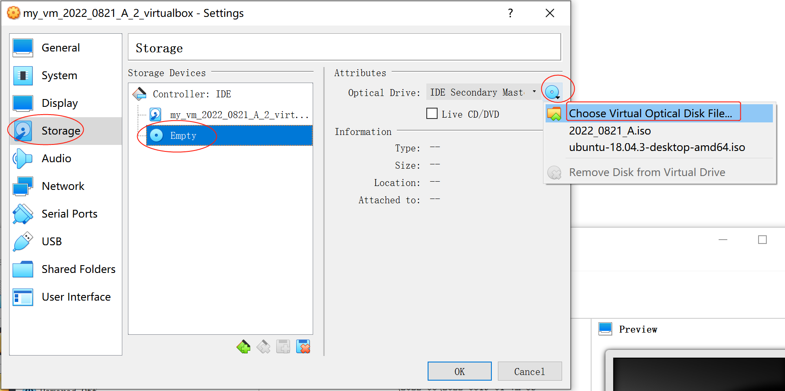
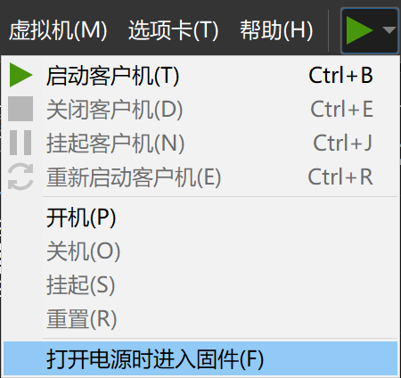
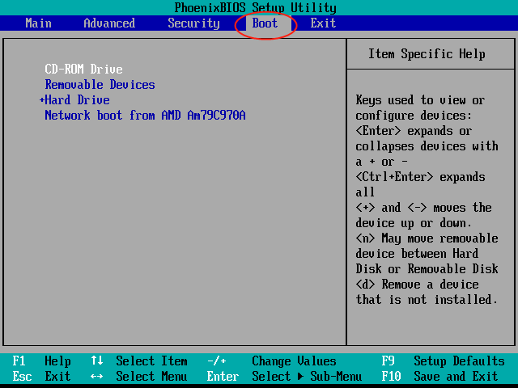
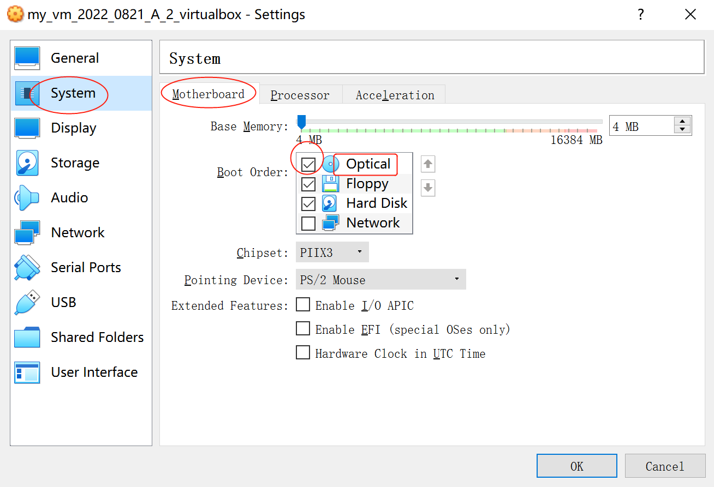

# Simple Bootable ISO Creator

This repo aims at producing a bootable `.iso` file according to the ISO9660 and EL TORITO standard.

It can be booted by VMware Workstation and VirtualBox. The UltraISO also considers it as "bootable".

## Files Structure

Main codes

- The `main.py` is the code that generates `2022_0821_A.iso`.
- The `utils.py` extracts some useful codes as a library.

Assistant codes

- The `read_iso.py` can parse and display some (but not all) information of an ISO file.
- The `read_bin.py` aims at displaying the bytes of binary machine codes.
- The `test.py` tests some Python grammar and verifies my library.

## How to Run

### 1 - Prepare ISO file

The `2022_0821_A.iso` is already attached in the repo.

If you want to further explore, modify and run `main.py` to generate new ISO.

### 2 - Create a Virtual Machine (VM) and Load the ISO File

During the VM creating process, never select an existing OS (such as Windows, Linux, ...) but always choose "others".

###### In VMware Workstation:

1. Select "**Typical (典型)**" option of the wizard.
2. When selecting the source of the guest OS, choose "**Use an ISO image (安装程序光盘映像文件(iso))**" and load the ISO file.
   - The wizard may give a warning that the OS in this image can not be detected. Just ignore it.
3. When selecting guest OS and its version, choose "**Others (其他)**" OS and "**Others (其他)**" version.
4. Input the name and location for the new VM.
5. For the disk size, **0.01 GB** is enough, because our system is too simple and never uses hard disk.
6. Finish.

###### In VirtualBox:

1. Input the name and location for the new VM, and choose "**Other**" type and "**Other/Unknown**" version. **4MB** for memory is enough.
2. For the disk size, **4MB** is enough.
3. Finish.
4. Open the VM "**Settings (设置)**" window.
5. Switch to the "**Storage (存储)**" tab on the left. Select the "**Empty (没有盘片)**" optical drive. In the "Attributes", click "**Choose Virtual Optical Disk File... (选择一个虚拟光盘文件...)**" and load the ISO file.

### 3 - Adjust the Boot Order and Start the VM

Usually, a machine can be booted from several ways, such as hard disk booting, CD booting and network booting. During booting, it tries the ways one by one in a specific order (called "boot order") until someone succeeds. So we need to adjust the boot order to let the VM to try the CD booting at first.

###### In VMware Workstation:

1. Switch on the VM by "**Start the Virtual Machine in BIOS Setup Mode (打开电源时进入固件)**".

2. Click into the VM screen, so your mouse and keyboard are focus on the guest system rather than the host.
3. Press "right-arrow" key to switch to the "Boot" tab. Press "down-arrow" key to select the "CD-ROM Drive". Press "+" key to push the "CD-ROM Drive" up, until it becomes the first entry.

4. Press "F10" key to save the configuration. Now the system starts, and a letter "H" is printed.

###### In VirtualBox:

1. Open the VM "**Settings (设置)**" window.
2. Switch to the "**System (系统)**" tab on the left, and the "**Motherboard (主板)**" tab on the top. In the "**Boot Order (启动顺序)**" list, check the "**Optical (光驱)**" item and move it to the top.

3. Start the VM. Now the system starts, and a letter "H" is printed.
   - VirtualBox may give a warning that a critical error has occurred while running the virtual machine and the machine execution has been stopped. Just choose "**Ignore (忽略)**".

